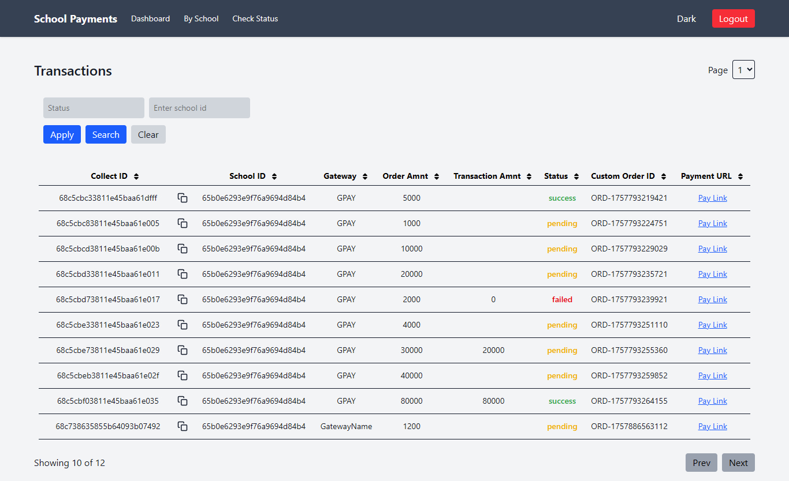
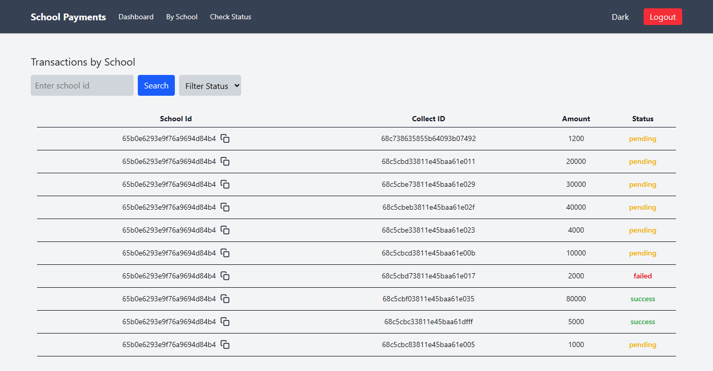
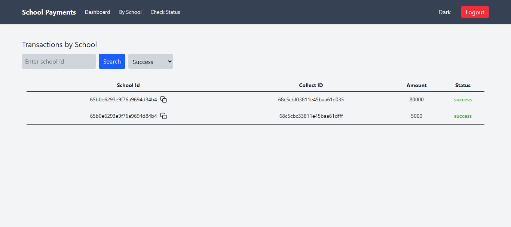
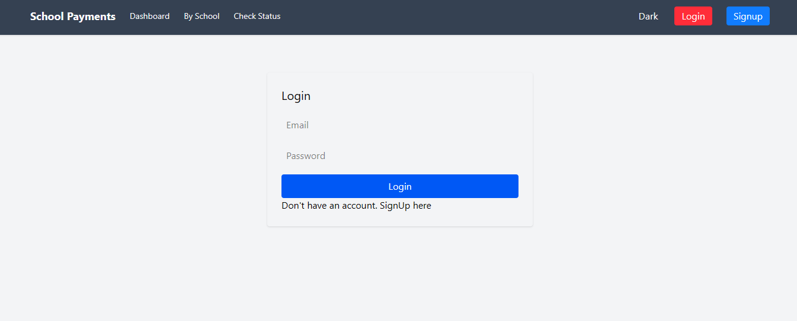
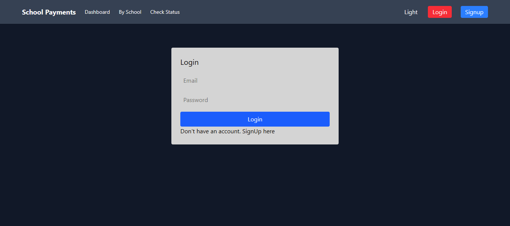

# School Payments Dashboard

A full-stack React + Redux dashboard for managing and viewing school payment transactions. This project provides authentication, transaction search/filtering, status checking, and a dark/light theme toggle.

## Features

- **Authentication**: Register and login with JWT-based authentication.
- **Dashboard**: View, filter, and sort all transactions.
- **School Transactions**: Search transactions by school ID and filter by status.
- **Check Status**: Check the status of a transaction using a custom order ID.
- **Theme Toggle**: Switch between dark and light modes, persisted across sessions.
- **Copy to Clipboard**: Easily copy IDs from tables.
- **UI**: Built with Tailwind CSS for modern, not responsive design.

---

## Getting Started


### Prerequisites

- Node.js
- npm


### Installation


1. **Clone the repository:**

   ```sh
   git clone <your-repo-url>
   cd school-payments/frontend
   ```

2. **Install dependencies:**

   ```sh
   npm install
   ```

3. **Configure Environment:**

   - Edit `.env` if needed. Default backend URL is `http://localhost:3000`.

4. **Start the development server:**

   ```sh
   npm run dev
   ```

   The app will be available at [http://localhost:5173](http://localhost:5173).
   
---

## Development Scripts

- `npm run dev` — Start development server
- `npm run build` — Build for production
- `npm run preview` — Preview production build

---


## Project Structure

```
src/
  components/
    Header.jsx
  pages/
    Dashboard.jsx
    SchoolTransactions.jsx
    CheckStatus.jsx
    Login.jsx
    SignUp.jsx
  store/
    authSlice.js
    transactionsSlice.js
    uiSlice.js
    index.js
  utils/
    api.js
  App.jsx
  main.jsx
  index.css
```

---

## Redux Slices

### 1. [`authSlice`](src/store/authSlice.js)

**Purpose:** Handles authentication state (JWT token and user info).

**State:**

- `token`: JWT token (persisted in `localStorage`)
- `user`: User object (optional)

**Actions:**

- `setToken(token)`: Sets and persists the JWT token.
- `setUser(user)`: Sets the user object.

**Usage Example:**

```js
import { useDispatch } from "react-redux";
import { setToken, setUser } from "../store/authSlice";

const dispatch = useDispatch();
dispatch(setToken("your-jwt-token"));
dispatch(setUser({ email: "user@example.com" }));
```

---

### 2. [`transactionsSlice`](src/store/transactionsSlice.js)

**Purpose:** Manages all transaction-related state and async actions.

**State:**

- `list`: Array of transactions
- `page`, `limit`, `total`: Pagination info
- `loading`: Loading state for async actions
- `lastParams`: Last used query params
- `error`: Error state for payment creation

**Async Actions:**

- `fetchTransactions(params)`: Fetches all transactions with/without filters.
- `fetchTransactionsBySchool({ schoolId, page, limit })`: Fetches transactions for a specific school.
- `checkTransactionStatus(custom_order_id)`: Checks status of a transaction.
- `createPayment(payload)`: Initiates a new payment.

**Usage Example:**

```js
import { useDispatch } from "react-redux";
import {
  fetchTransactions,
  fetchTransactionsBySchool,
  checkTransactionStatus,
} from "../store/transactionsSlice";

const dispatch = useDispatch();
dispatch(fetchTransactions({ page: 1, limit: 10 }));
dispatch(fetchTransactionsBySchool({ schoolId: "SCH001" }));
dispatch(checkTransactionStatus("ORDER123"));
```

---

### 3. [`uiSlice`](src/store/uiSlice.js)

**Purpose:** Manages UI state, especially dark/light theme.

**State:**

- `dark`: Boolean for dark mode (persisted in `localStorage`)

**Actions:**

- `toggleDark()`: Toggles dark mode and updates `localStorage` and `<html>` class.
- `setDark(value)`: Explicitly sets dark mode.

**Usage Example:**

```js
import { useDispatch } from "react-redux";
import { toggleDark, setDark } from "../store/uiSlice";

const dispatch = useDispatch();
dispatch(toggleDark());
dispatch(setDark(true)); // Enable dark mode
```

---

## API Utility

All API requests use [`api.js`](src/utils/api.js), which is an Axios instance with JWT token auto-attached from `localStorage`.

---

## Theming

- The theme toggle button is in the header.
- Clicking it updates the Redux state and persists the preference.
- All pages/components use the `dark` state to adjust their styles.

---

## Pages and Their Functionality

### 1. Dashboard (`/`)
- **Purpose:** Main overview of all payment transactions.
- **Features:**
  - View a paginated, sortable, and filterable list of all transactions.
  - search by status, school id.
  - Sort transactions by various columns (asc/desc).
  - Copy collect IDs easily.
  - Only accessible to authenticated users.
  - **making payments**.
  - **Visual Overview:** Includes a screenshot of the dashboard for a quick preview.

    

### 2. School Transactions (`/school`)
- **Purpose:** View transactions filtered by a specific school.
- **Features:**
  - Enter a school ID to view transactions for that school.
  - Filter transactions by status.
  - Copy school or school IDs.
  - Only accessible to authenticated users.
  - **Visual Overview:** Includes a screenshot of the dashboard for a quick preview.

    

### 3. Check Status (`/check-status`)
- **Purpose:** Check the status of a specific transaction.
- **Features:**
  - Enter a custom order ID to fetch and display the transaction status.
  - Shows the full response in a readable format.
  - Only accessible to authenticated users.
  - **Visual Overview:** Includes a screenshot of the dashboard for a quick preview.

    
    

### 4. Login (`/login`)
- **Purpose:** Authenticate users to access the dashboard.
- **Features:**
  - Enter email and password to log in.
  - Displays error messages for invalid credentials.
  - Redirects to the dashboard on successful login.
  - **Visual Overview:** Includes a screenshot of the dashboard for a quick preview.

    

### 5. Sign Up (`/signup`)
- **Purpose:** Register a new user account.
- **Features:**
  - Enter email and password to create an account.
  - Displays error messages for registration issues.
  - Redirects to the login page on successful signup.
  - **Visual Overview:** Includes a screenshot of the dashboard for a quick preview.

    

### 6. Header (Navigation)
- **Purpose:** Provides navigation and quick actions.
- **Features:**
  - Links to Dashboard, School Transactions, and Check Status pages.
  - Theme toggle (dark/light mode).
  - Login, Signup, and Logout buttons (depending on authentication state).

---

Each page is designed for a specific workflow in managing and tracking school payment transactions, with authentication and theming integrated
